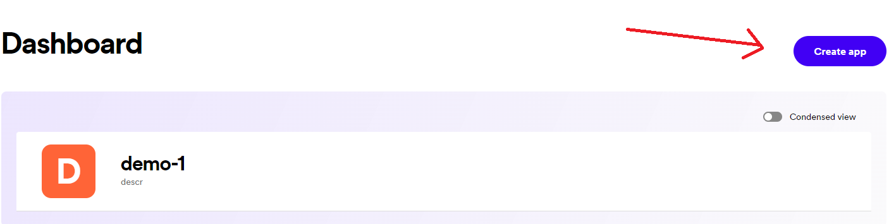
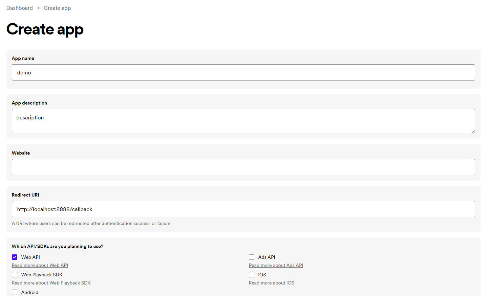
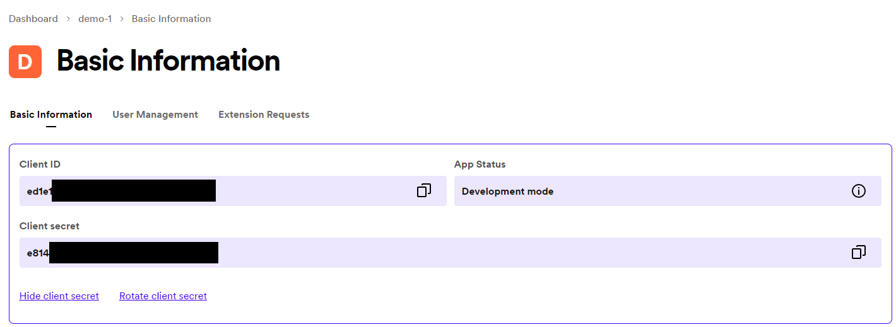
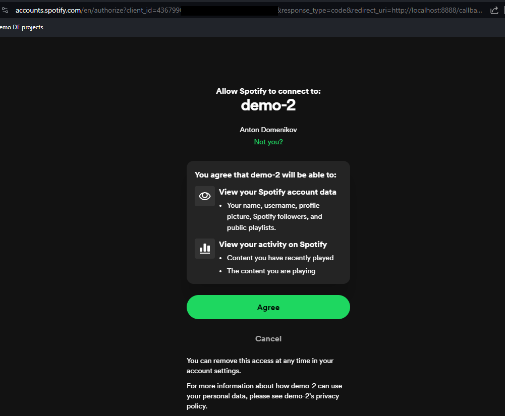
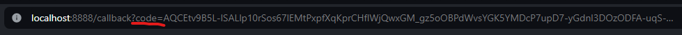
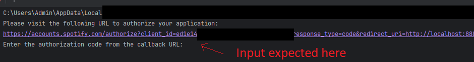
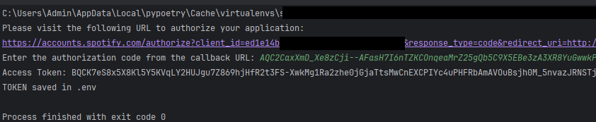

Welcome to my project repository! 

In this blog post, we'll explore how to build a simple ETL (Extract, Transform, Load) pipeline using Python, leveraging Spotify's API for data extraction, performing basic transformations, conducting Data Quality checks, and ultimately loading the retrieved data into a PostgreSQL database. 

Additionally, we'll demonstrate how to automate this process using Apache Airflow.


\
**Let's get started!**


## Step 1: Installing Poetry and Initializing Dependencies
This guide will walk you through the process of installing Poetry, a dependency manager for Python projects, and initializing a project with existing dependencies.

If you haven't installed Poetry yet, you can do so by following these steps:

### Linux/macOS:

Open your terminal and run the following command:

```bash
curl -sSL https://install.python-poetry.org | python3 -
```

### Windows:
Open PowerShell as Administrator and run the following command:
```commandline
(Invoke-WebRequest -Uri https://install.python-poetry.org/install.ps1 -UseBasicParsing).Content | python -
```

### Install Dependencies from Existing pyproject.toml:
We already have a pyproject.toml file in our repository with the dependencies listed, you can install them by running:

## STEP 2: Spotify API Setup Guide

This guide will walk you through the process of creating a Spotify Developer account, registering your application, and obtaining your API credentials to start using the Spotify Web API.

### Step 2.1: Create a Spotify Developer Account

1. Go to the [Spotify Developer Dashboard Login Page](https://developer.spotify.com/dashboard/login).
2. Log in with your existing Spotify account credentials or sign up for a new account if you don't have one.
3. Once logged in, you will be redirected to the Spotify Developer Dashboard. If not, use [Spotify Developer Dashboard](https://developer.spotify.com/dashboard).

### Step 2.2: Create a New Application

1. Click on the **Create an App** button. 

2. Fill in the required information for your application:
   - App name - can be anything
   - App description - can be anything
   - Redirect URI - You need to use ```http://localhost:8888/callback``` We pass the redirect URI during the Authorisation Flow, so they need to match exactly.
   - Which API/SDKs are you planning to use? - select Web API
     

### Step 2.3: Obtain Your API Credentials

1. After creating your application, you will be redirected to the application dashboard.
2. Click on your App > Top right corner click on Settings.
3. Here, you will find your **Client ID** and **Client Secret**. These are your API credentials required for authenticating requests to the Spotify Web API.

5. Make sure to keep your credentials secure. Do not share them publicly or expose them in your client-side code.
5. Go to [.env](.env) and put the Client ID and Client Secret there

### Step 2.4: Get your Token

1. Run [auth](auth.py) and open the link that's generated.
2. If you are not logged in, you will be prompted to do so using your Spotify credentials. After that you will be asked to authorize access to the data sets or features defined in the scopes.

3. Follow the instructions there. Get the Code from the new URL as the picture 

4. Make sure you get the whole string AFTER 'code=' and copy paste it into the expected input

5. Now the TOKEN is saved automatically in .env file and will be Valid for the next 3600 seconds / 1 hour. After that if needed run [auth](auth.py) again to get a new token.



### Additional Resources

- [Spotify Web API Documentation](https://developer.spotify.com/documentation/web-api/)
- [Spotify Developer Dashboard](https://developer.spotify.com/dashboard/login)

Congratulations! You have successfully set up your Spotify Developer account, registered your application, and obtained your API credentials.